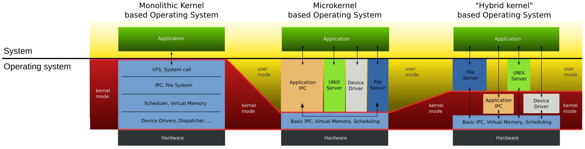
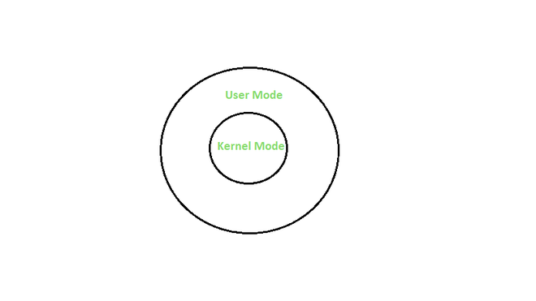
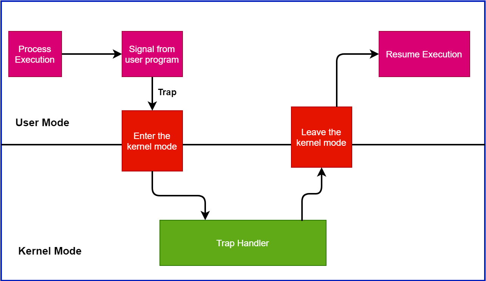
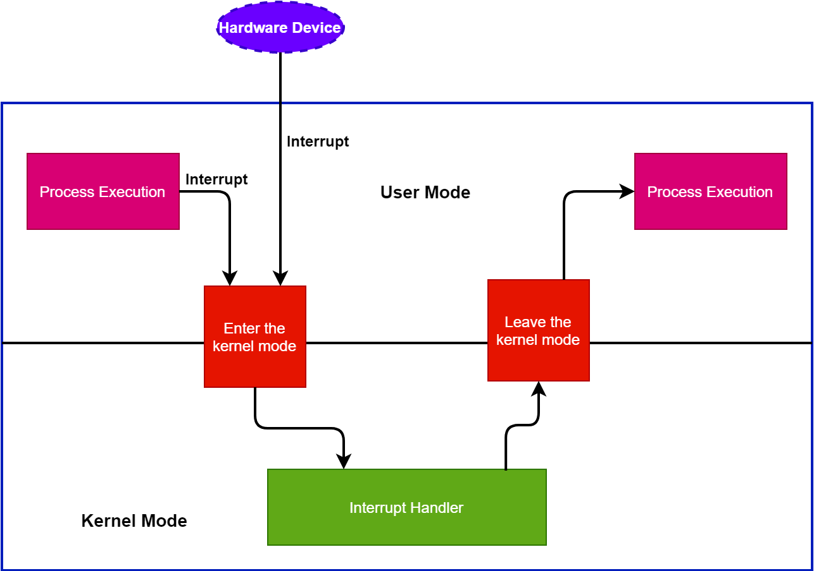

## Tipos de Kernel y sus Diferencias

El kernel es el núcleo del sistema operativo y puede clasificarse en varios tipos. Las diferencias entre ellos radican en cómo interactúan con el hardware y el nivel de privilegios que poseen. Los tipos comunes de kernel incluyen:

- **Kernel Monolítico:**
  
    Un kernel grande para todas las tareas. Es el único responsable de la gestión de la memoria y de los procesos, de la comunicación entre procesos y proporciona funciones de soporte de drivers y hardware. Los sistemas operativos que usan el kernel monolítico son Linux, OS X y Windows.

- **Microkernel:**

    El microkernel se ha diseñado intencionadamente de un tamaño pequeño para que en caso de fallo no paralice todo el sistema operativo. No obstante, para que pueda asumir las mismas funciones que un kernel grande, está dividido en varios módulos. Divide el sistema operativo en componentes mínimos, ejecutando solo funciones esenciales en el núcleo. Como ejemplos tenemos a QNX, MINIX, Mach de OS X.

- **Kernel Híbrido:**

    Combina características de los kernels monolíticos y microkernels para lograr un equilibrio entre rendimiento y modularidad. En este caso, el kernel grande se hace más compacto y modulable. Otras partes del kernel pueden cargarse dinámicamente. Como ejemplo tenemos a Windows NT/2000/XP.




## User vs Kernel Mode

- **Modo de Usuario:**
  
    Cuando se inicia un programa en un sistema operativo, digamos Windows, se inicia el programa en modo de usuario. Cuando un programa en modo de usuario solicita ejecutarse, Windows crea un proceso y un espacio de direcciones virtuales (espacio de direcciones para ese proceso). Los programas en modo de usuario tienen menos privilegios que las aplicaciones en modo de usuario y no pueden acceder a los recursos del sistema directamente. Por ejemplo, si una aplicación en modo usuario desea acceder a los recursos del sistema, primero deberá pasar por el kernel del sistema operativo mediante llamadas al sistema.

- **Modo Kernel:**
    El kernel es el programa central en el que se basan todos los demás componentes del sistema operativo, se utiliza para acceder a los componentes de hardware y programar qué procesos deben ejecutarse en un sistema informático y cuándo, y también gestiona la interacción del software y el hardware de la aplicación. Por lo tanto, es el programa más privilegiado; a diferencia de otros programas, puede interactuar directamente con el hardware. Cuando los programas que se ejecutan en modo de usuario necesitan acceso al hardware, por ejemplo, una cámara web, primero debe pasar por el kernel mediante una llamada al sistema y, para llevar a cabo estas solicitudes, la CPU cambia del modo de usuario al modo de kernel en el momento de la ejecución. Después de completar finalmente la ejecución del proceso, la CPU vuelve nuevamente al modo de usuario .



### Diferencias entre el modo Usuario y el modo Kernel
| Criterios | Modo Kernel | Modo Usuario |
| --------- | ----------- | ------------ |
| Acceso a Recursos | En el modo kernel, el programa tiene acceso directo e ilimitado a los recursos del sistema. | En el modo usuario, el programa de aplicación no tiene acceso directo a los recursos del sistema. Para acceder a los recursos, se debe realizar una llamada al sistema. |
| Interrupciones | En el modo kernel, todo el sistema operativo podría fallar si se produce una interrupción. | En el modo usuario, un solo proceso falla si se produce una interrupción. |
| Modos | El modo kernel también se conoce como modo maestro, modo privilegiado o modo sistema. | El modo usuario también se conoce como modo no privilegiado, modo restringido o modo esclavo. |
| Espacio de direcciones virtuales | En el modo kernel, todos los procesos comparten un solo espacio de direcciones virtuales. | En el modo usuario, todos los procesos tienen un espacio de direcciones virtuales separado. |
| Nivel de privilegio | En el modo kernel, las aplicaciones tienen más privilegios en comparación con el modo usuario. | Mientras que en el modo usuario, las aplicaciones tienen menos privilegios. |
| Restricciones | Como el modo kernel puede acceder tanto a los programas de usuario como a los programas del kernel, no hay restricciones. | Mientras que el modo usuario necesita acceder a los programas del kernel ya que no puede acceder directamente a ellos. |
| Valor del bit de modo | El bit de modo del modo kernel es 0. | Mientras que el bit de modo del modo usuario es 1. |
| Referencias de memoria | Es capaz de referenciar ambas áreas de memoria. | Solo puede hacer referencias a la memoria asignada para el modo usuario. |
| Crash del sistema | Un crash del sistema en el modo kernel es severo y complica las cosas. | En el modo usuario, un crash del sistema puede recuperarse simplemente reanudando la sesión. |
| Acceso | Solo se permite la funcionalidad esencial para operar en este modo. | Los programas de usuario pueden acceder y ejecutarse en este modo para un sistema dado. |
| Funcionalidad | El modo kernel puede referirse a cualquier bloque de memoria en el sistema y también dirigir la CPU para la ejecución de una instrucción, lo que lo convierte en un modo muy potente y significativo. | El modo usuario es un modo de visualización estándar y típico, lo que implica que la información no puede ejecutarse por sí misma ni hacer referencia a ningún bloque de memoria; necesita una Interfaz de Protocolo de Aplicación (API) para lograr estas cosas. |


## Interruptions vs Traps

En los sistemas operativos, las aplicaciones dependen de los eventos para poder ejecutar funciones. Por lo tanto, el sistema operativo se incluye en el paradigma del módulo controlado por eventos. Un evento puede ocurrir en un sistema operativo cuando ejecuta algunos programas o aplicaciones. Un evento desencadena la ejecución de un programa y cambia el estado de un sistema operativo de un modo de usuario a un modo de kernel.

- **Trap (Trampa):**
  
    Una trampa es una interrupción sincrónica provocada por una excepción en un proceso de usuario para ejecutar una funcionalidad. Condiciones de excepción como acceso no válido a la memoria, división por cero o un punto de interrupción pueden desencadenar una trampa en un sistema operativo.

    Una trampa cambia el modo de un sistema operativo a una rutina de kernel. Aquí, el sistema operativo ejecuta algunas acciones y devuelve el control al proceso que estaba ejecutando antes. Durante una trampa, la ejecución de un proceso se establece como de alta prioridad en comparación con el código de usuario.

    Además, el controlador de trampas es sincrónico. Cuando el sistema operativo detecta una trampa, detiene el proceso del usuario. Tan pronto como se completa la llamada al sistema, el sistema operativo reanuda y continúa la ejecución de los procesos del usuario:

    

    Además, una trampa puede verse como un controlador de interrupciones de la CPU. El sistema operativo guarda los punteros de la pila, registra la memoria y puede reanudar su ejecución anterior nuevamente.

    Tomemos un ejemplo. Supongamos que un usuario ejecuta un programa en un sistema operativo. Hay una declaración impresa en el programa:

    ```c
        printf("%s\n", cadena); 
    ```
    
    El sistema operativo ejecuta esta declaración y activa la función de impresión. Además, la función de impresión muestra la cadena devuelta por el código en el monitor. Por tanto, este es un ejemplo de trampa.

    El sistema operativo ejecuta la declaración de impresión con alta prioridad. Tan pronto como el sistema operativo encuentra esta declaración, cambia al modo kernel. Una vez que el sistema operativo finaliza la ejecución, el modo vuelve al modo de usuario.

- **Interrupt (Interrupción):**

    Una interrupción es una señal de hardware o software que exige atención instantánea por parte de un sistema operativo. Notifica al procesador que un proceso crítico necesita una ejecución urgente. En tal caso, se interrumpe el proceso de trabajo actual.

    Todas las computadoras modernas funcionan con interrupciones. El sistema operativo inicia una secuencia de instrucciones en una sola aplicación. Además, la ejecución de la instrucción continúa hasta que se completa o recibe una señal de interrupción. Además, una línea de control de bus específica llamada Rutina de servicio de interrupción (ISR) maneja las interrupciones en los dispositivos de E/S.

    Una CPU contiene un pin de interrupción específico conocido como pin INT para la interrupción. El pin INT conecta dispositivos de hardware como teclados y tarjetas NIC con la CPU. Cuando presionamos una tecla del teclado, se genera una interrupción. Posteriormente, el sistema operativo cambia el contexto e invoca la rutina del controlador de interrupciones del teclado. Después de completar la ejecución, se vuelve al proceso anterior:

    

    En general, varios dispositivos de hardware comparten un único pin INT mediante un controlador de interrupciones. Para determinar qué dispositivo produjo la interrupción, el procesador contacta al controlador de interrupciones. Además, el procesador realiza el procedimiento de manejo de interrupciones relevante, como el teclado o la rutina del manejo de interrupciones USB, según la comunicación con el controlador de interrupciones.

    En general, una interrupción puede ocurrir desde un dispositivo de hardware o de software. Una vez realizada una operación de E/S, podemos observar una interrupción del hardware. Por otro lado, cuando una aplicación finaliza o busca servicios específicos del sistema operativo, se produce una interrupción del software.

### Diferencias entre una Trampa y una Interrupción
| Trap (Trampa) | Interrupt (Interrupción) |
| ------------- | ------------------------ |
| Es una señal emitida por un programa de usuario | Es una señal emitida por un dispositivo de hardware |
| Es un proceso síncrono | Es un proceso asíncrono |
| Solo puede ocurrir desde un dispositivo de software | Puede ocurrir desde un dispositivo de software o hardware |
| Solo es generado por una instrucción del programa de usuario | Es generado por una instrucción del SO o del programa de usuario | 
| Son subconjutos de Interrupciones | Son superconjuntos de Trampas |
| Ejecuta una funcionalidad específica en el SO y da el control al manejador de trampas | Obliga al CPU a activar una rutina de manejo de interrupciones específica |