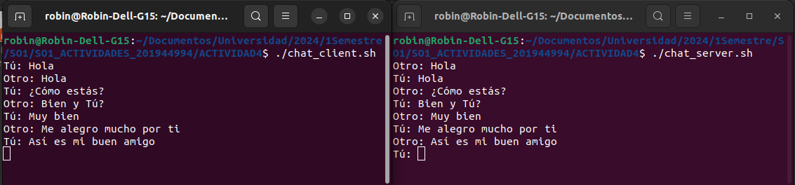

## ACTIVIDAD 4 - CHAT SIMPLE UTILIZANDO NAMED PIPES
En esta actividad se creo un chat simple entre dos usuarios en donde uno escribe y el otro escucha y viceversa. A continuación se enumeran los pasos realizados.

1. **Creación del script del Servidor:**
    
    Lo primero que se necesita hacer es crear el script que tendrá la lógica del chat del primer usuario al que llamaremos *servidor* y este script tendrá el nombre *chat_server.sh*

    ~~~bash
    #!/bin/bash

    # Definir los nombres de los pipes
    SERVER_CLIENT=/path/server_client
    CLIENT_SERVER=/path/client_server

    # Crear los pipes
    rm -f $SERVER_CLIENT
    rm -f $CLIENT_SERVER
    mkfifo $SERVER_CLIENT
    mkfifo $CLIENT_SERVER

    while true; do
        respuesta=$(cat $CLIENT_SERVER)
        echo "Otro: $respuesta"

        read -p "Tú: " mensaje
        echo "$mensaje" > $SERVER_CLIENT
    done
    ~~~

1. **Creación del script del Cliente:**
    
    Ahora vamos a crear el script que tendrá la lógica del chat del segundo usuario al que llamaremos *cliente* y este script tendrá el nombre *chat_client.sh*

    ~~~bash
    #!/bin/bash

    # Definir los nombres de los pipes
    SERVER_CLIENT=/home/robin/Documentos/Universidad/2024/1Semestre/SO1/SO1_ACTIVIDADES_201944994/ACTIVIDAD4/server_client
    CLIENT_SERVER=/home/robin/Documentos/Universidad/2024/1Semestre/SO1/SO1_ACTIVIDADES_201944994/ACTIVIDAD4/client_server

    # Crear los pipes
    rm -f $SERVER_CLIENT
    rm -f $CLIENT_SERVER
    mkfifo $SERVER_CLIENT
    mkfifo $CLIENT_SERVER

    while true; do
        read -p "Tú: " mensaje
        echo "$mensaje" > $CLIENT_SERVER

        respuesta=$(cat $SERVER_CLIENT)

        echo "Otro: $respuesta"
    done
    ~~~

    *Como podemos observar en los dos scripts el código es casi el mismo, simplemente en el while se invierten los pipes y también el orden entre el envío y la recepción del mensaje. ¿Por qué se da esto? porque la lógica de implementación implica que cuando el primer usuario va a enviar el mensaje el segundo usuario debe de estar escuchando, y no puede escribir hasta haber recibido el mensaje del primer usuario, en este momento entonces el primer usuario empieza a escuchar y el segundo envía el mensaje y así sucesivamente.*

    **Ejemplo del Chat:**
    